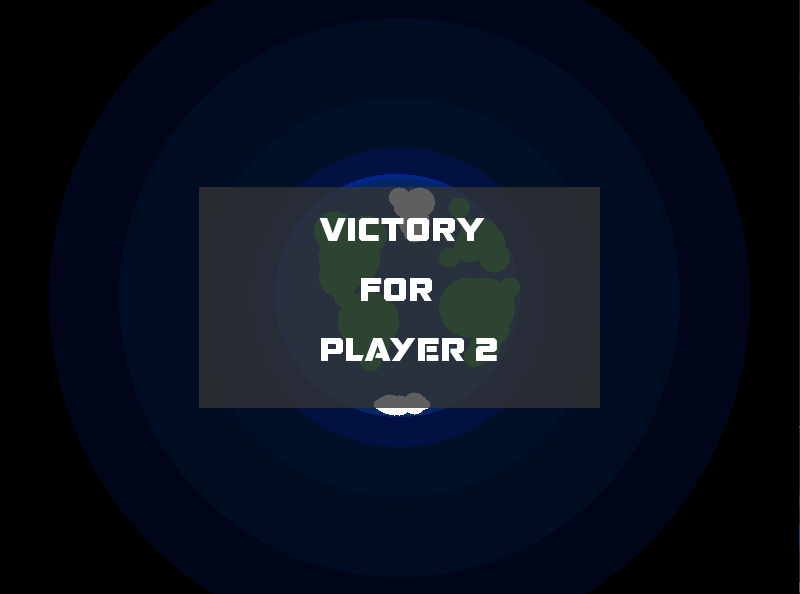
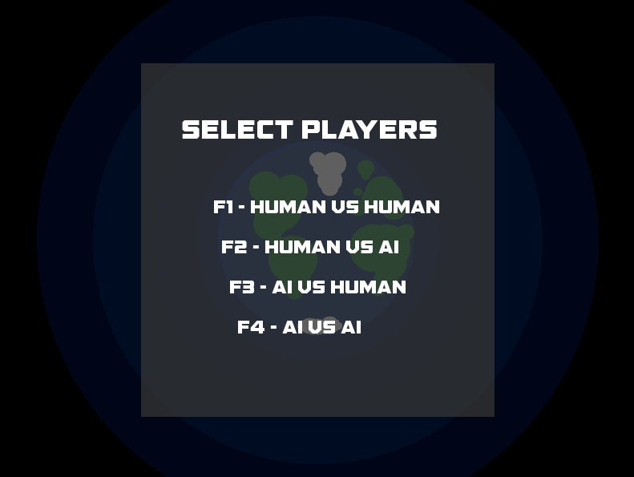

# Zeron Engine
A component based C++ Pong game built with a custom renderer as a Vancouver Film School Project.

#### Dependencies:
- CMake 3.8+, https://cmake.org/download/

#### How to Install:
- Run 'GenerateProject.bat' to create project solution

---
#### Screenshots:

Copyright (C) 2020, Eser Kokturk. All Rights Reserved.
